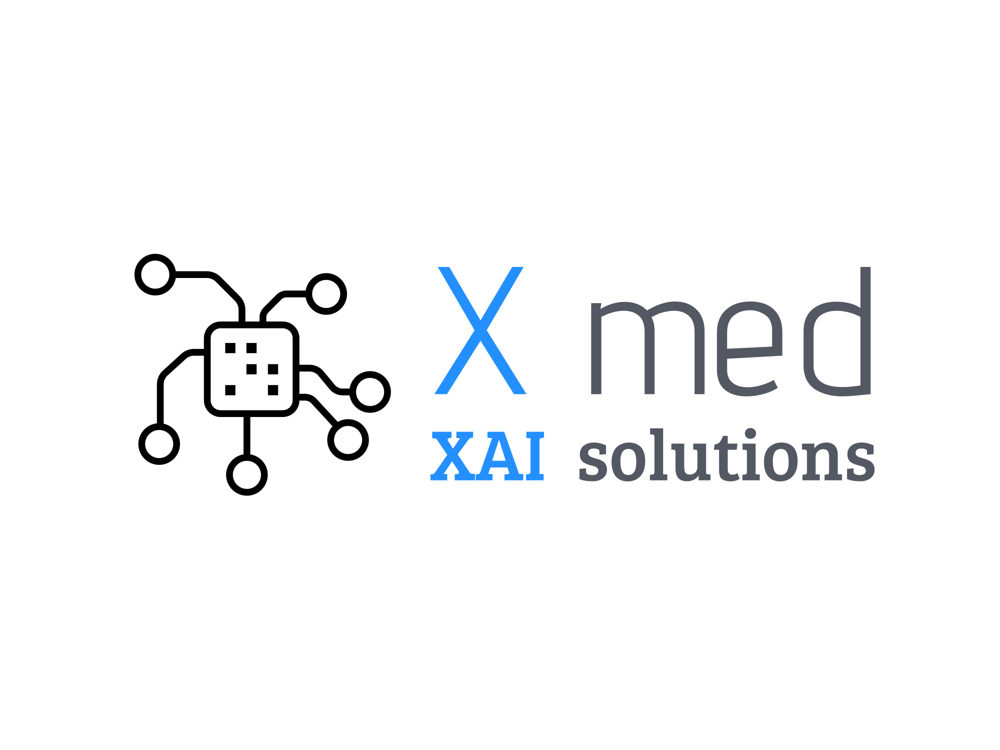

# XMED Project

  

## Overview

Welcome to the XMED Project repository! This project aims to leverage state-of-the-art Self-Supervised Learning (SSL) using Vision Transformers (ViT) (specifically DINO) in the medical domain. The project goal was to integrate these models with Explainable AI (XAI) methods and deploy the resulting application as a web service on the IBM Cloud.

## Online demo

Demo app instance is running at IBM Cloud OpenShift Cluster. To check it out, visit:
<a href="https://xmed-xmed-app.mycluster-fra02-b3-307961-7a4f0f60e0bb120db8b4212665d0ca17-0000.eu-de.containers.appdomain.cloud/"><strong>DEMO</strong></a>

## Prerequisites

Look at `requirements.txt` file.

## License
MIT